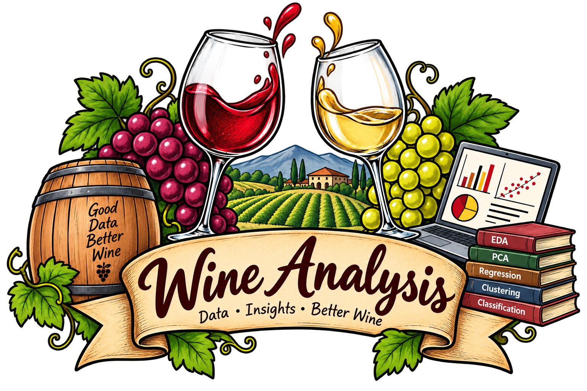
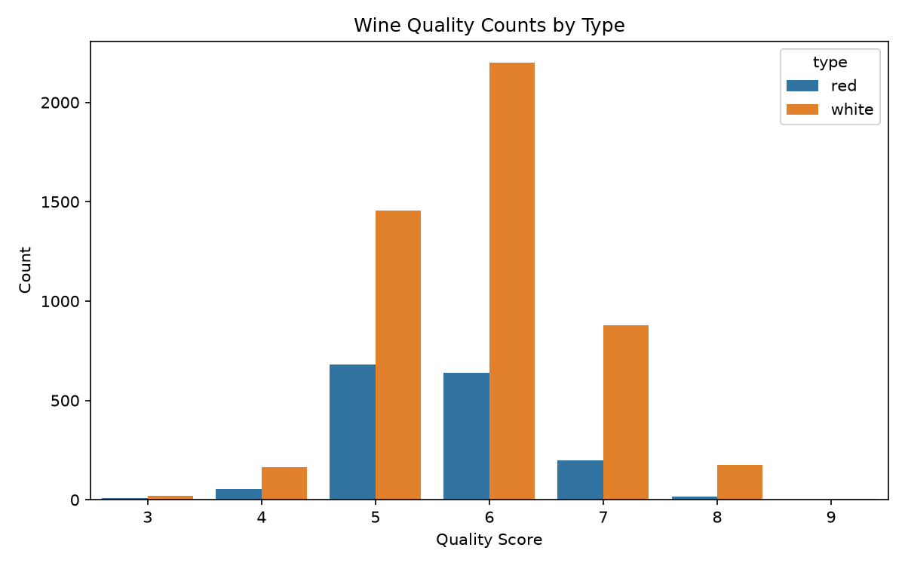
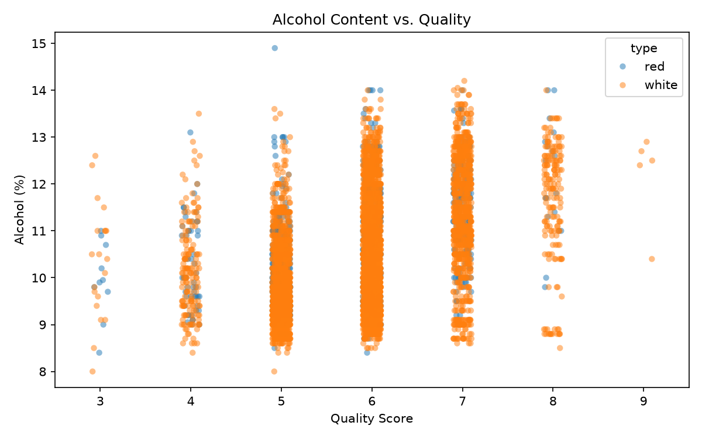
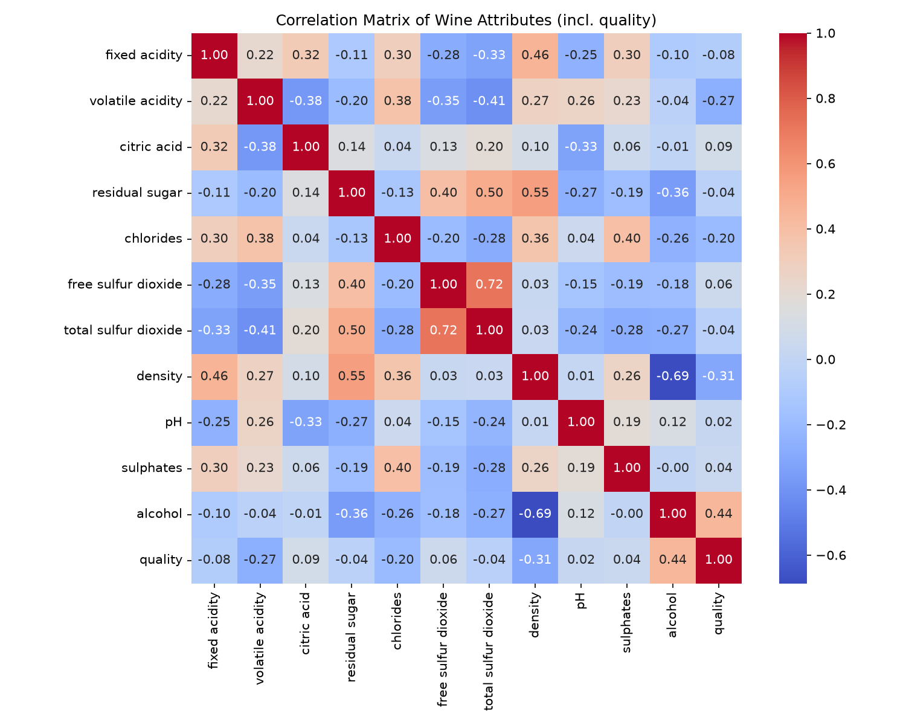
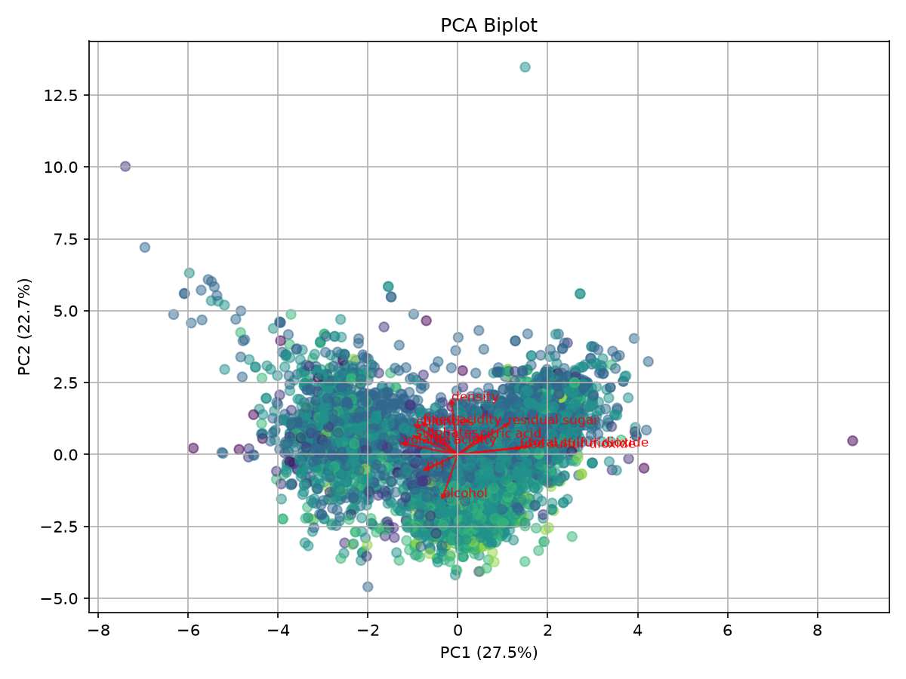
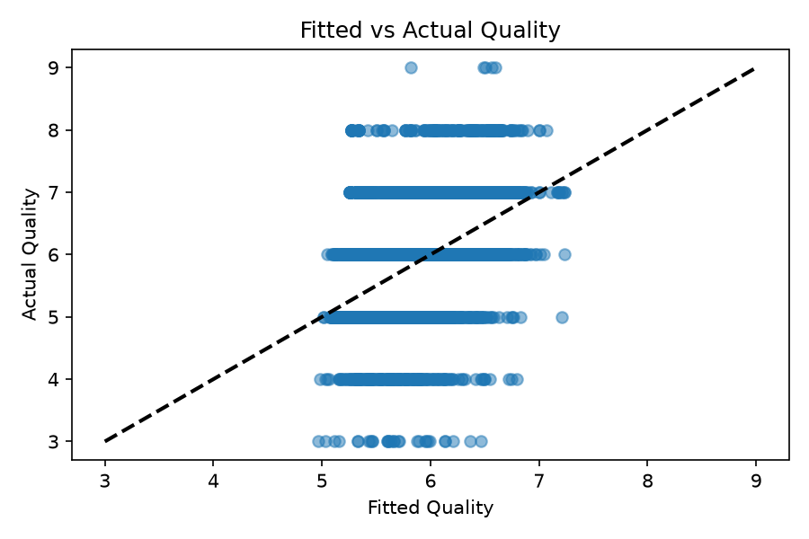
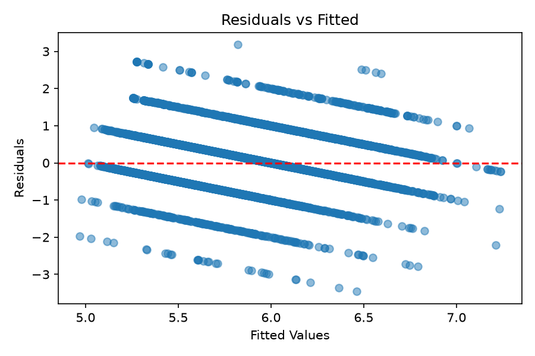

<div align="center">



# Wine Quality Analysis

**Which chemistry predicts a better-tasting wine?**

Exploratory analysis, regression and clustering/classification on the UCI Wine Quality dataset with parallel **R + Python** pipelines, a reproducible **RMarkdown report** and a **Docker** image.

[](pyproject.toml)
[](Dockerfile)
[](LICENSE)
[](pyproject.toml)
[](Dockerfile)

</div>

## Overview

This project asks a simple question: **can physicochemical measurements explain expert quality scores for wine?** Using the UCI Wine Quality dataset (red and white Vinho Verde from Portugal), it links 11 lab measured properties like acidity, sugar, sulphates, alcohol, pH and more to sensory quality ratings from 3 to 9.

Everything runs end to end and reproduces exactly:

- **Dual pipeline:** same analysis in R (`scripts/Wine_Quality_Analysis.R`) and Python (`scripts/wine-data-analysis.py`) for cross validation
- **Interactive notebook:** `notebooks/Wine_Quality_Analysis.ipynb` for exploration
- **Knitted report:** `reports/report.Rmd` generates `output/report.html`
- **One command reproducibility:** `make all` or `docker run`

> Source: [UCI ML Repository Wine Quality](https://archive.ics.uci.edu/dataset/186/wine+quality) (Cortez et al., 2009). 6,497 rows, 1,599 red and 4,898 white.

---

## Dataset at a Glance

| Property | Detail |
|---|---|
| **Samples** | 6,497 wines (4,898 white, 1,599 red) |
| **Features** | 11 numeric: fixed/volatile acidity, citric acid, residual sugar, chlorides, free/total SO₂, density, pH, sulphates, alcohol |
| **Target** | `quality` is sensory score 3 to 9 (median 6, about 77 percent of samples are 5 to 6) |
| **Mean quality** | White 5.88 vs. Red 5.64 |
| **No missing values** | Semicolon-delimited CSVs fetched directly from UCI |

---

## What We Analyze

| # | Analysis | What it does | Output |
|---|---|---|---|
| 1 | **Distribution & class balance** | Quality histograms split by type; checks skew and imbalance | `wine_quality_counts.png` / `wine-1.png` |
| 2 | **Feature relationships** | Alcohol vs. quality (jitter/strip), boxplots of pH / sugar / citric acid / sulphates by quality | `alcohol_vs_quality.png`, `attributes_by_quality.png` |
| 3 | **Correlation structure** | Pearson heatmap across all 11 predictors + quality | `correlation_heatmap.png` |
| 4 | **Dimensionality reduction (PCA)** | Standardized PCA with scree and biplot and loadings | `pca_scree.png`, `pca_biplot.png` |
| 5 | **Regression** | OLS predicting quality from alcohol + sulphates + pH + type; residuals-vs-fitted & fitted-vs-actual diagnostics | `residuals_vs_fitted.png`, `fitted_vs_actual.png` |
| 6 | **Clustering** | K-means on scaled chemistry using elbow and silhouette to pick *k*, PCA scatter with clusters | `cluster-elbow.png`, `cluster-silhouette.png`, `cluster-pca.png` |
| 7 | **Classification** | Binary *high quality (7 and above)* using 70/30 split and 5 fold CV with logistic regression versus random forest, confusion matrices and ROC/AUC | `roc-logistic.png`, `roc-randomforest.png` |

> R main analysis: `scripts/Wine_Quality_Analysis.R:1` · Python mirror: `scripts/wine-data-analysis.py:1` · Clustering/classification: `scripts/Wine_Clustering_and_Classification.R:1`

---

## Key Findings

Based on the full 6497 row dataset, not just plots but the numbers behind them:

**1. Alcohol is the strongest single predictor.**
Pearson *r* is **0.44** with quality, far ahead of the next best which is citric acid at 0.09. Density (*r* is -0.31) and volatile acidity (*r* is -0.27) are the strongest negative correlates. Higher alcohol wines consistently score higher, visible in both red and white.

**2. Chemistry explains some but not all of taste.**
OLS `quality ~ alcohol + sulphates + pH + type` gives **R2 about 0.22** (adj. R2 0.219, n is 6497). Significant effects are alcohol **plus 0.32 per vol percent** (*p* less than 0.001), sulphates **plus 0.70** (*p* less than 0.001), white versus red **plus 0.33** (*p* less than 0.001). pH is not significant once the others are controlled. Sensory quality is noisy and partly subjective.

**3. White and red wines live in different chemical neighborhoods.**
Whites average higher residual sugar and free SO2, reds higher volatile acidity and sulphates. That shift drives PCA. **PC1 (27.5 percent)** loads on sulfur compounds and sugar versus acidity, **PC2 (22.7 percent)** on density and acidity versus alcohol. Together PC1 and PC2 capture **about 50 percent** of variance, five PCs reach about 80 percent.

**4. Structure without labels still finds groups.**
On standardized predictors, elbow and silhouette curves point to **k equals 3** clusters. A PCA projection with K means assignments shows reasonably separated ellipses. Clustering recovers chemically coherent groups even before quality is introduced.

**5. Predicting high quality (7 and above) is feasible but hard.**
Only **about 16 percent** of wines score 7 or above, so the task is imbalanced. Logistic regression and random forest (5 fold CV tuned via `caret`) both produce meaningful ROC curves (see `output/roc-*.png`). Random forest ranks **alcohol, sulphates and volatile acidity** highest in variable importance, which echoes the correlation and regression story.

> Bottom line is that alcohol and sulphates matter most, whites score marginally higher and chemistry alone gets you about a fifth of the way to predicting taste. It is useful signal, not a full substitute for a palate.

---

## Figures

Generated by the Python pipeline into `figures/` (R pipeline mirrors to `output/wine-*.png`):

<p align="center">
  
  
</p>
<p align="center">
  
  
</p>
<p align="center">
  
  
</p>

*See also `figures/pca_scree.png`, `figures/attributes_by_quality.png`, and clustering ROC plots in `output/`.*

---

## Project Structure

```
Wine-Analysis/
├── assets/                          # logo
├── figures/                         # Python-generated plots
├── notebooks/
│   └── Wine_Quality_Analysis.ipynb  # interactive R notebook
├── reports/
│   ├── report.Rmd                   # knitted HTML report
│   └── report.tex
├── scripts/
│   ├── Wine_Quality_Analysis.R              # main R pipeline
│   ├── Wine_Clustering_and_Classification.R # clustering + classification
│   └── wine-data-analysis.py                # Python pipeline
├── Dockerfile
├── Makefile
├── pyproject.toml
├── run_analysis.sh
└── uv.lock
```

---

## Tech Stack

`Python` `R` `Jupyter` `pandas` `numpy` `scikit-learn` `statsmodels` `matplotlib` `seaborn` `tidyverse` `corrplot` `factoextra` `caret` `randomForest` `pROC` `cluster` `RMarkdown` `Docker` `uv` `Ruff`

---

## Getting Started

### Prerequisites

- R 4.x plus `tidyverse`, `corrplot`, `factoextra`, `rmarkdown`, `caret`, `randomForest`, `pROC`, `cluster`
- Python 3.10 or newer plus [uv](https://github.com/astral-sh/uv)
- pandoc for the HTML report. Or just use Docker

### Install

```bash
# Python deps
uv sync

# R deps
R -e "install.packages(c('tidyverse','corrplot','factoextra','rmarkdown','caret','randomForest','pROC','cluster'), repos='https://cloud.r-project.org')"
```

---

## Usage

```bash
make all          # R plus Python plus report to output/*.png, figures/*.png, output/report.html
make analysis     # R only
make python       # Python only (uv run python scripts/wine-data-analysis.py)
make clustering   # K means plus classification
make report       # knit reports/report.Rmd
make clean        # remove generated files
```

Shell helper (same as `make all`):

```bash
bash run_analysis.sh
```

Python flags:

```bash
uv run python scripts/wine-data-analysis.py          # headless Agg backend, good for CI
uv run python scripts/wine-data-analysis.py --show    # interactive display
```

---

## Docker (no local setup)

```bash
docker build -t wine_analysis .
docker run --rm \
  -v "$(pwd)/output:/home/wine_analysis/output" \
  -v "$(pwd)/figures:/home/wine_analysis/figures" \
  wine_analysis   # runs `make all` by default
```

The image installs R, Python via `uv`, and pandoc.

---

## Reports

- **HTML report**: `make report` creates `output/report.html` (from `reports/report.Rmd:1`)
- **LaTeX**: `reports/report.tex`
- **Notebook**: open `notebooks/Wine_Quality_Analysis.ipynb` with an R kernel

---

## References

- Cortez, P. et al. "Modeling wine preferences by data mining from physicochemical properties." *Decision Support Systems*, 47(4), 2009.
- UCI Machine Learning Repository: Wine Quality Datasets.

## License

MIT. See [LICENSE](LICENSE).

## Author

**Nitin Kumar Sharma** [@Nitinx12](https://github.com/Nitinx12) and [nitinx12.github.io](https://nitinx12.github.io)
